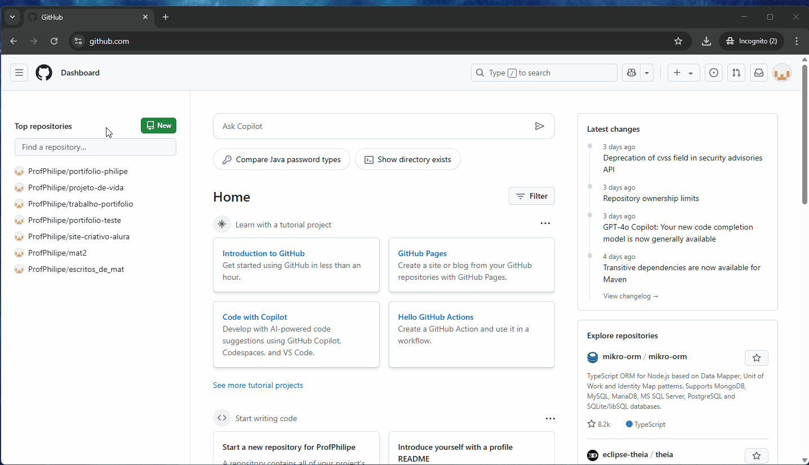

# Como criar um repositório no GitHub

1. Acesse o endereço [GitHub](https://github.com/) e faça o login na sua conta. Não esqueça que você pode traduzir o site utilizando a opção de tradução do navegador.

2. Ao acessar o site, no lado esquerdo, você encontrará uma lista de repositórios, que já estão criados na sua conta. Caso a lista esteja vazia ou você está começando um novo projeto, você precisará criar um novo repositório. Para isso, siga os passos: 
   1. clique no botão verde, "new" ou "novo";
   2. informe um nome para o repositório. Geralmente, utilizamos um nome que esteja relacionado ao projeto;
   3. por fim, clique no botão verde criar repositório;
   4. após a criação, abrirá uma janela com o nome que você utilizou no lado esquerdo superior;

